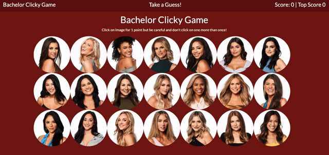

# Clicky Game

The Clicky Game is a memory game created with React. The application renders a set of different images, and the user's job is to try to click on each image only once. Once an image is clicked, all the images are shuffled and if it is an image not previously clicked, the user gets 1 point. If the same image is clicked more than once, the user loses and their score is reset.



## Demo
In the project directory, you can run 
### `npm start`
or navigate in your browser to:

[View Live Site](https://xrachhel.github.io/clickyGame/)

## Technologies Used

* [HTML](https://developer.mozilla.org/en-US/docs/Web/HTML): used for structuring and creating elements on the DOM
* [CSS](https://developer.mozilla.org/en-US/docs/Web/CSS): used to style html elements on the page
* [JavaScript](https://developer.mozilla.org/en-US/docs/Web/JavaScript): used to create responsive, interactive elements on the page
* [Node.js](https://developer.mozilla.org/en-US/docs/Web/API/Node): JavaScript runtime, allows users to run JavaScript on the server
* [React](https://reactjs.org/): JavaScript library for building user interfaces


## Code Snippet

```
shuffleImages = newClicked => {
    for(var i = newClicked.length -1; i > 0; i--){
      const j = Math.floor(Math.random() * (i +1))
      const temp = newClicked[i];
      newClicked[i] = newClicked[j]
      newClicked[j] = temp
    };
  };

```
This portion of the script file displays the function that shuffles the images when an image is clicked. The parameter for this function is the array of images, which is a JSON file. A random number between 0 and the number of images is generated and stored in the variable 'j'. In the for loop, the index of the current image will then be swapped with the random index 'j'.

## Authors

**Rachel Yeung**
* [Portfolio](https://rachelyeung.herokuapp.com/)
* [Github](https://github.com/xrachhel)
* [LinkedIn](https://www.linkedin.com/in/rachel-yeung-814986159/)

